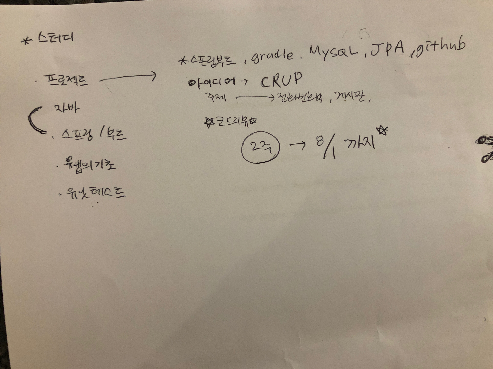

# board api

## 1. requirements


## 2. specs
> java 1.8 (+)
> spring boot
> h2 db -> (mysql)
> jpa
> gradle

## 3. How to use 
### h2 web-console
> 1. http://{host}:{port}/h2-console

## 4. Api Docs
common prefix - http://{host}:{port}/{version} 이하 API 문서에서는 생략

### Notice
> GET 
>   /board/notice
>   /board/notice/{notice_id}
>> request param
>> ```text
 notice_id : long
>> ```

> POST
>     /board/notice
>> request body     
>>
>> ```json
>>  {
>>      "title" : "string",
>>      "content" : "string",
>>      "userId": "string"
>>  }
>> ```
 
> PUT
>     /board/notice/{notice_id}
>> request param
>> ```text
 notice_id : long
>> ```
>> request body     
>> ```json
>>  {
>>      "title" : "string",
>>      "content" : "string",
>>      "userId": "string"
>>  }
>> ```

> DELETE
>     /board/notice/{notice_id}
>> request param
>> ```text
 notice_id : long
>> ```
